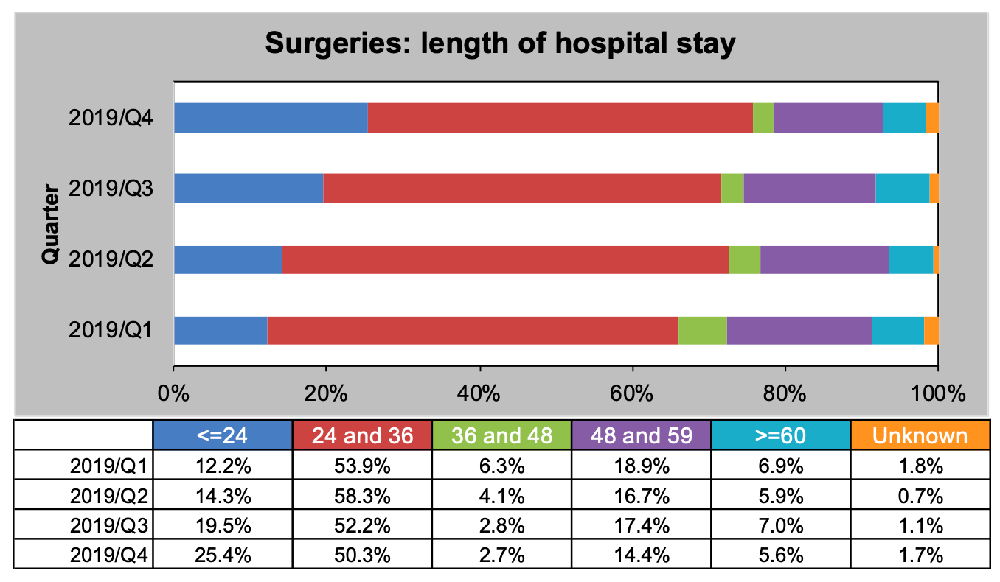
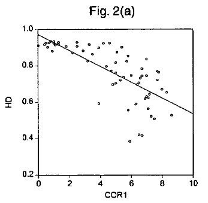
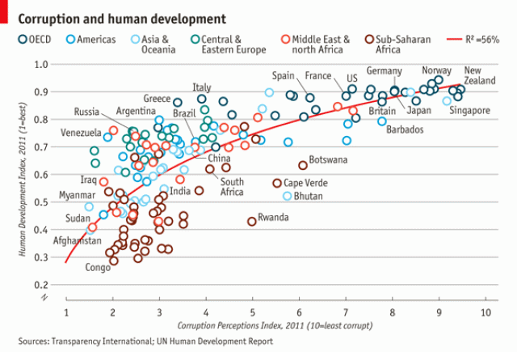

```{r setup, include=FALSE}
options(htmltools.dir.version = FALSE)
library(xaringanthemer)
style_solarized_light(
  code_font_size = "0.7rem",
  code_inline_font_size = "0.9rem"
)

# devtools::install_github("gadenbuie/xaringanExtra")
library(xaringanExtra)
use_clipboard()
use_scribble()
use_tachyons()
# use_webcam()
use_fit_screen()
use_panelset()

knitr::opts_chunk$set(
  fig.width = 6,
  message = FALSE,
  warning = FALSE,
  comment = "",
  cache = F,
  echo = FALSE,
  dpi = 150
)
# devtools::install_github("EvaMaeRey/flipbookr")
library(flipbookr)
library(tidyverse)
library(palmerpenguins)

# devtools::install_github("gadenbuie/countdown")
library(countdown)
library(fontawesome)
library(beepr)
```

class: middle, center

## `r fa("hand-peace")`

## Julia Romanowska

<br>

### bioinformatics/biostatistics `r fa("laptop-code")`

### visualization `r fa("image")`

### co-founder of R-Ladies Bergen

https://jrom.bitbucket.io/homepage/

???

Couple of words about me - I am a bioinformatician/biostatistician, I love
visualizing data and programming, and I am a co-founder of R-Ladies Bergen.
We have actually a very cool meetup today at R-Ladies Bergen - if you want
to watch some entertaining show about visualization and statistics, join
us at 6PM!

https://www.meetup.com/rladies-bergen/events/277543752/

---

class: inverse, bottom

## What this will *not* be:

- not an R/programming course
- not an art course
- not much about color theory
- not much about tidying data

???

OK - back to the talk. "Basics of data visualization". Since time is of
essence today, I will try to keep it short. I will not teach you how to
program, I will not teach you about artistic stuff in visualization, I
will only touch on the color theory and I will not talk about how to create
tidy, analysis-ready datasets.

---

class: inverse, right, bottom

## What this will be:

- how to show your data to various audience
- how to choose the story in your data
- how to __start__ with ggplot2
- where to search for help

???

Today, I will focus on how to adapt the visualization for various occasions,
how to find the message you want to convey through your visualization,
how to start with the ggplot2 R-package, which is a powerful tool, and
where to search for help.

---

# Warmup

```{r}
countdown(minutes = 5, seconds = 0, warn_when = 15, top = "0", play_sound = TRUE)
```

## TASK

> Grab a piece of paper and a pencil and draw this data!

```{r}
knitr::kable(
tibble::tribble(
~DATE, ~CAPACITY, ~DEMAND,
"2019-04", 29263, 46193,
"2019-05", 28037, 49131,
"2019-06", 21596, 50124,
"2019-07", 25895, 48850,
"2019-08", 25813, 47602,
"2019-09", 22427, 43697,
"2019-10", 23605, 41058,
"2019-11", 24263, 37364,
"2019-12", 24243, 34364
)
)
```

???

# Questions

- was it easy to imagine the data?
- how did you start drawing?
- did you change your point of view of the data _after_ you've sketched it?
- what questions arised when you saw the data plotted?

---

## Critique

```{r}
countdown(minutes = 5, seconds = 0, warn_when = 15, top = "0", play_sound = TRUE)
```

### GROUP TASK

> How can we improve this figure?


<!--  -->
https://community.storytellingwithdata.com/exercises/how-can-we-improve-this-graph

???

## Assisting questions:

- is the data correctly represented in the figure?

- is the title meaningful?

- is the graph self-explanatory?

- can you easily draw conclusion from the graph?

- what about use of colors?

## Conclusions

There are a lot of choices to make when creating a visualization.

---

## Data viz _design_


???

It's not enough to _show_ your data - you need to carefuly pick the datapoints you want to focus on,
think about the fonts, the axes, the orientation of the plot, the colors(!), and title/captions.

All this process is called _designing_ your visual.

And as with any other design or planning, it all starts with...

--

- `r fa("pencil-alt")` pen & `r fa("sticky-note")` paper

???

When you grab a blank sheet of paper, you're getting free of all the limitations that a tool of your choice can give you.
And of the frustrations as well, if you're only beginning to learn the tool!
With a pen and paper, you may focus on what's important for the presentation of the data...

--

- `r fa("question-circle")` what the data tells me?

???

Normally, we would plot data when we want to explore some variables or when we have results of an analysis.
One thing is known: we don't know how the data look like. We may know how it _should_ look like, though.
That's why we may start designing with one type of plot in mind, but in the end the plot might look completely different!
That's why it's important to draw by hand some sketches and think about the question here.
When we finally have plotted something and understood the message behind the data, we need to improve the visual.

--

- **declutter** + **explain**

???

- do we really need all the points?
- what about the axis ticks? and axis labels?
- can we include a take-home message in title/caption?
- is the legend in right place?
- have we used **color** wisely? (I will talk about the colors next)

--

<br>
> Who's my target audience?

???

This entire process needs to be repeated when we present our plot for different groups of people!

This process is very important and one could talk about this for hours. I've just mentioned important points, and gathered some references for you to read if you're interested.

---

## Choosing medium and audience

- popular science *vs.* scientific article
- manuscript *vs.* presentation
- font size, level of details

 

src: *Akcay, S. (2006). Corruption and human development. Cato Journal 26(1), 29-48*; 
https://www.economist.com/graphic-detail/2011/12/02/corrosive-corruption

---

## Choosing color

- good tool for choosing palette: [ColorBrewer](https://colorbrewer2.org/)    
by Cynthia Brewer

- recommended paper:    
[Crameri, F., Shephard, G. E., & Heron, P. J. *(2020)*. The misuse of colour in science communication. *Nature Communications*, 11(1), 1–10.](https://www.nature.com/articles/s41467-020-19160-7)

- wrong color palette can _distort_ the data and _change_ the meaning of your visual

---

class: inverse, left, bottom

## SUMMARY

### know your data

???

So what we've learned til now:

- spend time on exploring the data and check what the data tells you

--

### know your audience

???

- when critiquing the plot, have in mind who will look at it and under what circumstances!
- you can't show the same plot in a scientific journal article, and during a presentation for students!

--
### _design_ your visual

???

- use time to design the visual
- don't just show all the data you have, but choose carefully what to show and how so that the message is clear

And now, let's get our hands dirty with some code

---

class: inverse, right, middle

## Example plot with ggplot2

---

## Data

<div style="float: right; position: fixed; right: 10px; top: 10px;">
<br>
</div>

[palmerpenguins](https://allisonhorst.github.io/palmerpenguins/)

<br><br><br>

```{r}
penguins
```

???

I will be using this simple dataset with morphological data of penguins living on a certain island.

--

> **IMPORTANT** start with tidy data!

???

I will not spend much time on this because we don't have time, but remember one thing:
you need to start visualizing with _tidy_ dataset! What this means?

--

**each row is an observation, each column is a variable**

---

```{r penguins_species, include = FALSE}
ggplot(data = penguins) +
  aes(x = bill_length_mm,
    y = bill_depth_mm) +
  geom_point(
    aes(color = species,
    shape = species),
      size = 2) + 
  geom_smooth(method = "lm",
    se = FALSE,
    aes(color = species))
penguins_default <- last_plot()
```

`r chunk_reveal("penguins_species", break_type = "auto", chunk_options = "warning = FALSE", font_size_code = "50%", widths = c(0.5, 0.45))`

???

Basics of ggplot2:

- layers
- 'aesthetics' + data + geom

---

```{r penguins_species2, include = FALSE}
penguins_default +
  scale_color_manual(
    values = c("darkorange",
               "darkorchid",
               "cyan4")
    ) +
  facet_grid(rows = vars(species)) +
  labs(title = 
    "Penguin species differentation") +
  labs(subtitle = 
    "based on bill depth and bill length") +
  xlab("bill length (mm)") +
  ylab("bill depth (mm)") +
  theme_minimal() +
  theme(
    plot.title =
      element_text(face = "bold"),
    plot.subtitle =
      element_text(face = "italic")) +
  theme(legend.position = "none")
```

`r chunk_reveal("penguins_species2", break_type = "auto", chunk_options = "warning = FALSE", font_size_code = "50%", widths = c(0.5, 0.45))`

???

OK, to był podstawowy graf. Teraz zróbmy go wyjątkowego.

- zmiana kolorystyki,
- rozbicie na podgrafy wg.gatunku,
- dodanie tytułu
- podpisy na osiach
- wygląd grafu

---

## More...

- **Extensions:** [ggextensions](https://exts.ggplot2.tidyverse.org/gallery/)

- [R-Ladies Bergen](https://join.slack.com/t/rladies-norway/shared_invite/zt-5unpqk3m-GnaNwMfr1HminEQ6vym~zA) and [R-Ladies Global](https://rladies-community-slack.herokuapp.com/) `r fa("slack")`

- Some useful links: https://jromanowska.github.io/Visualization-basics-for-EPINOR/references.html
